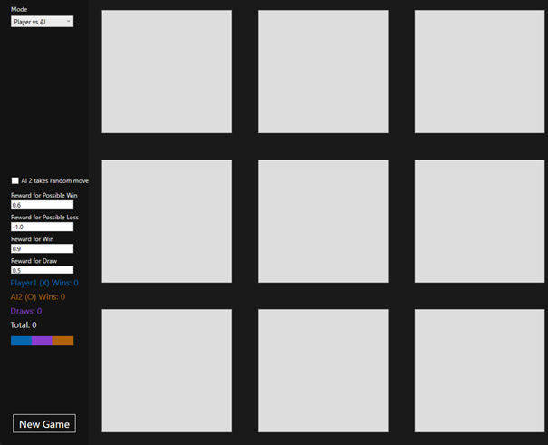
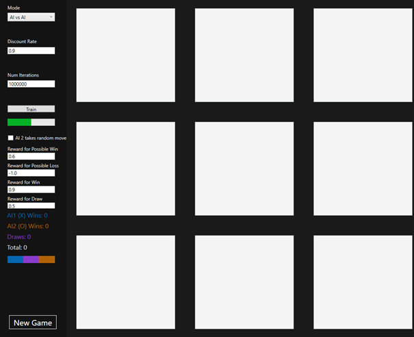
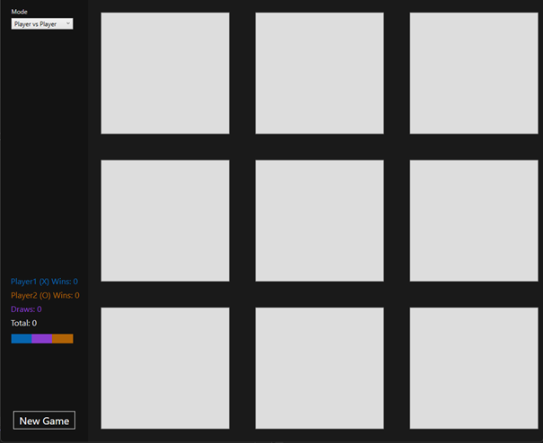
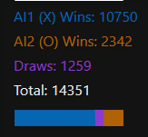
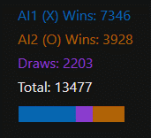
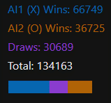

# Anbei die von Word zu Markdown konvertierte Dokumentation zu diesem Projekt. 

Das Projekt wurde mit der Note 1.0 bewertet

## Tic-Tac-Toe Lösung mit Q-Learning

Betreuer: Professor Dr. Cristof Rezk-Salama

### Inhaltsverzeichnis

[Tic-Tac-Toe Lösung mit Q-Learning i](#_Toc159706329)

[1 Motivation 1](#_Toc159706330)

[2 Übersicht über die Softwarearchitektur und Spielaufbau 2](#_Toc159706331)

[2.1 Position 2](#_Toc159706332)

[2.2 GameBoard 2](#_Toc159706333)

[2.3 TicTacToeGame 2](#_Toc159706334)

[2.4 MainWindow 3](#_Toc159706335)

[2.4.1 Modus: Player vs. AI 3](#_Toc159706336)

[2.4.2 Modus: AI vs. AI 4](#_Toc159706337)

[2.4.3 Modus: Player vs. Player 5](#_Toc159706338)

[3 Bedienungshinweise 6](#_Toc159706339)

[4 Analyse und Bewertung der Ergebnisse 7](#_Toc159706340)

[5 Reflexion 9](#_Toc159706341)

# Motivation

Das Spiel Tic-Tac-Toe, das oft als einfaches Kinderspiel betrachtet wird, bringt mathematische Herausforderungen und bietet einen faszinierenden Einblick in die Anwendung von künstlicher Intelligenz in der Welt der Spiele. Besonders beeindruckend persönlich finde ich die mathematische Komplexität dieses scheinbar simplen Spiels. Mit über 5500 möglichen Spielzuständen erfordert es eine komplexe Strategie, um die optimale Entscheidung in jedem Zug zu treffen.

Die Hauptzielsetzung besteht entsprechend darin, eine KI zu entwickeln, die Tic-Tac-Toe mit einer Intelligenz spielt, die menschlichen Spielern ähnelt. Die KI soll in der Lage sein, aus vergangen Erfahrung, sowohl positive als auch negative, zu lernen und optimale Entscheidungen zu treffen, um den Gegner zu besiegen.

Einen besonderen Fokus lege ich dabei auf die Gestaltung des Codes. Dieser soll nicht nur klar strukturiert und gut dokumentiert sein, sondern auch leicht erweiterbar. Durch eine sorgfältige und durchdachte Architektur wird sichergestellt, dass zukünftige Änderungen und Erweiterungen effizient implementiert werden können, ohne dabei bereits bestehenden Code zu beeinträchtigen.

Die Leistung der KI wird anhand objektiver Kriterien wie Sieg-, Niederlage und Unentschiedensstatistiken bewertet, um den Lernfortschritt zu überwachen und mögliche Verbesserungsmöglichkeiten am Reward-System zu identifizieren.

Durch die Entwicklung dieser KI möchte ich ein tieferes Verständnis für die Anwendung von künstlicher Intelligenz in Spielen erlangen.

# Übersicht über die Softwarearchitektur und Spielaufbau

Der Softwareaufbau basiert auf den Kernklassen: „MainWindow“, „TicTacToeGame“, „GameBoard“ und „Position“. Diese Kernklassen nutzen dabei die durch Herrn Professor Rezk-Salama bereitgestellten Klassen „QLearning“ und „QTable“, sowie die Interfaces „IAction“ und „IGameState“, welche eine generische Implementierung einer Q-Learning KI sind. Eine eigene Implementierung erschien mir nicht sinnvoll, da die bereitgestellten Klassen bereits äußerst generisch und optimiert sind.

## Position

Die Klasse „Position“ implementiert das Interface „IAction“ und wird zur Ausführung der Spielzüge der Q-Learning KI benötigt. Jede Position besitzt einen Namen und eine X beziehungsweise Y Koordinate.

## GameBoard

Innerhalb der Klasse „GameBoard“ wird ein Spielbrett durch ein zweidimensionales String Array realisiert. Die Größe des Spielfelds kann durch Angabe von Parameter beim Aufruf des Konstruktors festgelegt werden. Des Weiteren bietet die Klasse Methoden, um den Wert eines bestimmten Werts festzulegen oder zu erhalten und eine Methode, um das gesamte Feld zurückzusetzen. Durch die generische Implementierung kann die Klasse auch für andere Spiele verwendet werden, die ein Raster- beziehungsweise Feldbasiertes-Spielbrett erfordern, wie zum Beispiel 4-gewinnt.

## TicTacToeGame

Die Klasse „TicTacToeGame“, welche „IGameState“ implementiert, stellt das Spielprinzip von Tic-Tac-Toe dar.

Der Konstruktor initialisiert das Spielfeld und das Array „allActions“, welche eine Durchnummerierung der Felder von 0-8, beginnend oben links Zeile für Zeile darstellt.

Den Kern dieser Klasse stellt die Methode „ExectueAction“ dar, denn diese Methode führt einen Spielzug aus. Nach Ausführung des Zuges, wird der aktuelle Spielstand geprüft. Basierend auf dem Spielstand wird dann ein Wert, der Reward, festgelegt. War der Zug gut oder sogar ein Siegeszug, gibt es einen positiven Reward. Besteht nach dem Zug die Möglichkeit zu verlieren, wird ein negativer Reward zurückgegeben. Dieser Wert wird von der künstlichen Intelligenz genutzt, um die möglichen Züge zu vergleichen.

Die Methode “TryExecuteAction“ wird zum manuellen Spielen benötigt.

Weiterhin bietet die Klasse Methoden, um den Wert eines bestimmten Feldes zu erhalten, das Spielfeld zurückzusetzen oder zur Abfrage des Spielstands.

Die Implementierungen von „Id“ und „PossibleActions“ sind durch das Interface „IGameState“ vorgeschrieben. Die Künstliche Intelligenz benötigt „Id“, um zwischen Spielzuständen zu unterscheiden und „PossibleActions“, um zu wissen, welche Züge möglich sind. Die „Id“ wird durch die Felder bestimmt und durch eine UInt32 Zahl mit 18 Binärstellen repräsentiert, wobei jedes Binärpaar ein Feld darstellt.

## MainWindow

Die Klasse „MainWindow“ verarbeitet den User-Input und steuert die Spielzüge.

Dabei ist zwischen drei Modi zu unterscheiden: „Player vs. AI“, „AI vs. AI“ und „Player vs. Player“. Der Modus „AI vs. AI“ kann auch synonym Training genannt werden. Beim Wechseln der Modi, werden verschiedene Elemente in der Benutzeroberfläche aus- beziehungsweise eingeblendet. Zusätzlich wird die Statistik zurückgesetzt.

### Modus: Player vs. AI

Im ersten Modus „Player vs. AI“ wartet die Benutzeroberfläche auf Input durch den User, also einen Klick auf einen der Spielfelder.

Abbildung 1 Benutzeroberfläche für Modus "Player vs. AI"

Nach Registrierung eines Inputs durch den User wird die Methode „ButtonListener“ ausgeführt. Daraufhin wird die Methode „TryExecuteAction“ aus der Klasse „TicTacToe“ ausgeführt.  
Falls der Spieler nach dem Zug nicht gewonnen hat und das Brett noch nicht voll ist, wird ein LearnStep der AI2 ausgeführt. Das bedeutet das die Künstliche Intelligenz einen Spielzug basierend auf ihrer Bewertung für den aktuellen Spielstand ausführt.

Ist das Spiel beendet, entweder vor oder nach dem Zug der KI, wird das Spiel zurückgesetzt, woraufhin wieder auf Input durch den User gewartet wird.

Da hier gegen die AI2 gespielt wird, lernt diese weiterhin. Entsprechend sind Einstellungen für den Reward weiterhin änderbar. Die Checkbox „AI 2 takes random moves“ ermöglicht es dem Nutzer gegen einen Bot zu spielen, der nur zufällige Züge durchführt. Dies ermöglicht ein besonders effizientes Testen der Leistung der KI.

### Modus: AI vs. AI

Der Modus „AI vs. AI“ ist sowohl im Bereich der Benutzeroberfläche als auch im Code deutlich umfangreicher als der Modus „Player vs. AI“.

Abbildung 2 Benutzeroberfläche für Modus "AI vs. AI"

In diesem Modus ist die direkte Eingabe der Spielzüge deaktiviert. Dafür sind auf der linken Seite des Fensters mehr Module zu finden. Hier kann durch jeweils eine Texteingabe die Discount Rate und die Anzahl der Iterationen, welch die KI für das Trainieren durchlaufen soll. Eine Iteration entspricht einem Spielzug.

Die Einstellungen für die Belohnungen sind weiterhin verfügbar, genauso wie die Checkbox „AI 2 takes random moves“. Durch die Checkbox kann ein guter Vergleich gezogen werden, wie gut die AI 1 gegen einen Spieler spielt, der ebenfalls lernt oder wie gut diese gegen einen Spieler spielt der rein zufällige Züge spielt.

Das Training kann durch einen Klick auf den Button „Train“ gestartet werden. Hier wird im Hintergrund die Methode „StartTraining“ ausgeführt. Diese startet einen Timer, welche in festgelegten zeitlichen Abständen, auch Ticks genannt, die Methode „LearnStep“ ausführt. Der Fortschritt des Trainings kann durch die Progress Bar verfolgt werden, welche sich unter dem „Train“-Button befindet.

Bereits beim Starten des Programms wurden zwei verschiedene Q-Learning KIs initialisiert. Diese KIs wechseln sich mit jedem Tick des Timers ab. Ist das Spiel nach einem Zug beendet, wird die Statistik (siehe Abbildung 2) aktualisiert und das Spiel zurückgesetzt.

Die Statistik gibt einen Einblick in die Verteilung der Ausgänge der Spiele. Die Progress Bar zeigt deutlich das relative Verhältnis, zwischen der Anzahl an Gewinne durch Spieler X, Anzahl der Gewinne durch Spieler 0 und Anzahl von Spielen, die in einem Unentschieden endeten.

### Modus: Player vs. Player

Der Modus „Player vs. Player” ist lediglich ein Zusatz und ermöglicht es dem Nutzer gegen einen Freund oder sich selbst zu spielen. Nach einem Zug wird erneut auf einen Zug gewartet, anstatt eine künstliche Intelligenz spielen zu lassen. Die Statistik wird weiterhin angezeigt, um sich messen zu können.

Abbildung 3 Benutzeroberfläche für Modus "Player vs. Player"

# Bedienungshinweise

Die Software bietet die Möglichkeit zwischen drei Modi zu wechseln. Die Modi können über das Dropdown Menü an der oberen rechten Ecke gewählt werden.

In jedem Modi ist der Button „New Game“ verfügbar. Damit kann das aktuelle Spiel abgebrochen werden, und von neuem begonnen werden. Gewinnt ein Spieler, geschieht das Zurücksetzen automatisch nach einer Sekunde.

Da der Q-Learning Algorithmus auf einem Belohnungssystem beruht, können im Modus „Player vs. AI“ und „AI vs. AI“, die Belohnungen für bestimmte Spielzüge angepasst werden. Diese Werte dürfen mindestens -1.0 und höchstens 1.0 betragen. Wird ein niedriger beziehungsweise höherer Wert eingetragen, wird dieser mit einem gültigen Wert überschrieben, welcher die geringste Differenz aufweist.

Die AI, sowohl AI1 und AI2, sind zu Start des Programms untrainiert, das heißt sie können keine strategisch guten Züge spielen. Um AI2 zu trainieren, muss zunächst der Modus „AI vs. AI“ ausgewählt werden, und mit dem Button „Train“ das Training begonnen werden. Die künstliche Intelligenz AI2 lernt jedoch nur, falls die Checkbox, nicht angekreuzt ist. Ist diese angekreuzt, lernt diese nicht, sondern wählt zufällige Züge. Diese Checkbox ist ebenfalls im Modus „Player vs. AI“ verfügbar.

Befindet sich das Programm im Modus „Player vs. AI“ oder „Player vs. Player“ kann ein Spiel mit einem Mausklick auf eines der neun Felder begonnen werden.

Die vorgesehene .NET-Framework-Version für dieses Programm ist „.NET 8.0“.

# Analyse und Bewertung der Ergebnisse

Durch die Statistik lässt sich einfach überprüfen, ob die künstliche Intelligenz beim Spielen dazu lernt oder nicht. Spielt beispielsweise AI1 mit 100.000 Iterationen gegen einen Spieler der nur zufällige Züge spielt, also ist die Checkbox „AI 2 takes random moves“ angekreuzt, lässt sich ein Unterschied in der Verteilung der Siege einsehen.

Abbildung 4 Statistik mit 100.000 Iterationen AI vs. Random

Abbildung 5 Statistik mit 100.000 Iterationen AI vs. AI

Entgegen meinen Erwartungen zeigte sich, dass die entwickelten KIs scheinbar nicht perfekt lernen. Die Anzahl der Spiele, die in einem Unentschieden endeten, ist nicht signifikant höher als die Anzahl der Gewinne für die beiden KIs. Im Gegenteil, aus mehr als 13 Tausend Spielen, sind nur 2203 in einem Unentschieden geendet. Dies steht im Widerspruch zu der Annahme, dass beide Spieler bestrebt sind, ihren Belohnungswert zu maximieren, was in einem strategischen Ausgleich und häufigeren Unentschieden resultieren sollte.

Mögliche Ursachen für dieses Phänomen könnten in der Auswahl und Feinabstimmung der Parameter für Belohnung, Discount Rate, Learning Rate und Exploration Rate liegen. Es ist anzumerken, dass die hohe Anzahl der internen Spielzustände möglicherweise ebenfalls eine Rolle spielt. Die „Id“ eines States wird durch die gesetzten Felder bestimmt, dabei wird jedoch keine Symmetrie oder Rotation des Spiels betrachtet. Dies führt zu einer übermäßigen Anzahl von verschiedenen Spielzuständen, die die KI kennt, wodurch sie jeden Spielzustand potenziell seltener erreicht.

Durch eine Reduzierung dieser Zahl, könnte das Lernverhalten entsprechend effizienter gestaltet werden, was zu einer verbesserten Entscheidungsfindung führen könnte.

In einem Versuch, den Lernprozess zu optimieren, habe ich die Anzahl der Iterationen erhöht, um sicherzustellen, dass die KI häufiger verschiedene Spielzustände erreicht. Jedoch zeigte sich, dass trotz dieser Maßnahme das Lernverhalten der KI unverändert blieb. Selbst als die Iterationen von 100.000 auf 1.000.000 erhöht wurden, gab es keine bemerkenswerte Veränderung bei der Verteilung der Siege.

Abbildung 6 Statistik mit 1.000.000 Iterationen AI vs. AI

Trotz der nicht vollständig zufriedenstellenden numerischen Ergebnisse war die subjektive Erfahrung beim Spielen gegen die trainierte KI spürbar anspruchsvoller. Obwohl ich sie nicht als unbesiegbar empfinde, vermittelte sie den Eindruck einer deutlich höheren Spielstärke im Vergleich zu untrainierten beziehungsweise weniger trainierten Versionen. Diese Beobachtung legt nahe, dass trotz quantitativer Einschränkungen qualitative Verbesserungen in der Leistung der KI erzielt wurden, was auf einen vielversprechenden Ansatz für zukünftige Entwicklungen hinweist.

# Reflexion

Die vorliegenden Ergebnisse zeigen deutlich die Bedeutung einer kontinuierlichen Evaluation und Optimierung von KI-Modellen, um deren Leistungsfähigkeit zu gewährleisten.

Insbesondere erwies sich die Bewältigung der hohen Anzahl von Spielzuständen als eine komplexe Aufgabe, die die Effektivität des Lernverfahrens beeinträchtigte. Weiterhin stellte sich die Integration von Rotation und Symmetrie sowie die optimale Verteilung von Rewards als große Hürde dar.

Ich möchte gerne meinen Dank an Herrn Professor Rezk-Salama für die Bereitstellung des Projektes „AI“ ausdrücken. Das Projekt in Kombination mit den Vorlesungen des Vergangenem Semester waren ein angenehmer und leicht verständlicher Einstieg in dieses äußerst komplexe Thema.

Die Konfrontation mit diesen Problemen zeigt mir deutlich, wie wichtig es in der KI-Entwicklung ist, Finetuning zu betreiben, gleichzeitig bestätigte es meine Annahme, dass die KI ein sehr komplexes, aber interessantes Gebiet der Informatik ist.
